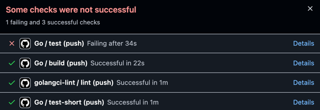

# gold-botsrv template

Run `make init` first.

1. Add your bot token and db creds to cfg/local.toml
2. Use MicroOLAP db designer to generate docs/{name}.pdd and docs/{name}.sql files, or make sql file yourself
3. Use make mfd commands to generate db structures and repo methods
4. Add bot commands in RegisterBotHandlers function, place bot business-logic in botsrv package

- optional: use make run to start bot
- optional: use make fmt lint before commit to check your code, or add them to your pre-commit hook
- optional: linters and tests are present in git, use them to check your code past-commit:

made by kroexov, origin by vmkteam